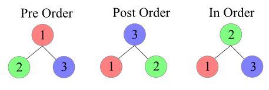

# 0x1D. C - Binary trees

## [0-binary_tree_node.c]()

`Path` − Path refers to the sequence of nodes along the edges of a tree.

`Root` − The node at the top of the tree is called root. There is only one root per tree and one path from the root node to any node.

`Parent` − Any node except the root node has one edge upward to a node called parent.

`Child` − The node below a given node connected by its edge downward is called its child node.

`Leaf` − The node which does not have any child node is called the leaf node.

`Subtree` − Subtree represents the descendants of a node.

`Visiting` − Visiting refers to checking the value of a node when control is on the node.

`Traversing` − Traversing means passing through nodes in a specific order.

`Levels` − Level of a node represents the generation of a node. If the root node is at level 0, then its next child node is at level 1, its grandchild is at level 2, and so on.

`Keys` − Key represents a value of a node based on which a search operation is to be carried out for a node.

[Tree](https://www.tutorialspoint.com/data_structures_algorithms/tree_data_structure.htm)

## [3-binary_tree_delete.c]()

## [6-binary_tree_preorder.c]()

## Authors

- [OMAR DOUIBA](https://github.com/OmarDouiba)

## Badges

## License

[MIT](https://choosealicense.com/licenses/mit/)
